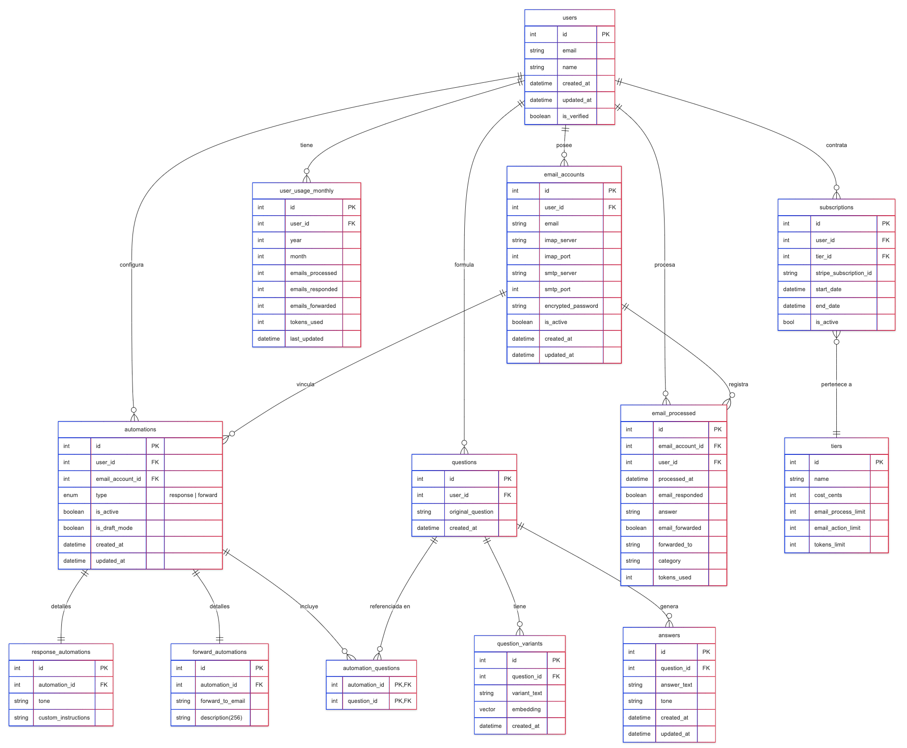

```plaintext
erDiagram
    users {
        int id PK
        string email
        string name
        datetime created_at
        datetime updated_at
        boolean is_verified
    }
    email_accounts {
        int id PK
        int user_id FK
        string email
        string imap_server
        int imap_port
        string smtp_server
        int smtp_port
        string encrypted_password
        boolean is_active
        datetime created_at
        datetime updated_at
    }
    questions {
        int id PK
        int user_id FK
        string original_question
        datetime created_at
    }
    question_variants {
        int id PK
        int question_id FK
        string variant_text
        vector embedding
        datetime created_at
    }
    answers {
        int id PK
        int question_id FK
        string answer_text
        string tone
        datetime created_at
        datetime updated_at
    }
    automations {
        int id PK
        int user_id FK
        int email_account_id FK
        enum type  "response | forward"
        boolean is_active
        boolean is_draft_mode
        datetime created_at
        datetime updated_at
    }
    response_automations {
        int id PK
        int automation_id FK
        string tone
        string custom_instructions
    }
    forward_automations {
        int id PK
        int automation_id FK
        string forward_to_email
        string description(255)
    }
    automation_questions {
        int automation_id PK,FK
        int question_id PK,FK
    }
    email_processed {
        int id PK
        int email_account_id FK
        int user_id FK
        datetime processed_at
        boolean email_responded
        string answer
        boolean email_forwarded
        string forwarded_to
        string category
        int tokens_used
    }
    user_usage_monthly {
        int id PK
        int user_id FK
        int year
        int month
        int emails_processed
        int emails_responded
        int emails_forwarded
        int tokens_used
        datetime last_updated
    }
    tiers {
        int id PK
        string name
        int cost_cents
        int email_process_limit
        int email_action_limit
        int tokens_limit
    }
    subscriptions {
        int id PK
        int user_id FK
        int tier_id FK
        string stripe_subscription_id
        datetime start_date
        datetime end_date
        bool is_active
    }
    users ||--o{ email_accounts : "posee"
    users ||--o{ email_processed : "procesa"
    users ||--o{ user_usage_monthly : "tiene"
    users ||--o{ questions : "formula"
    users ||--o{ automations : "configura"
    users ||--o{ subscriptions : "contrata"
    email_accounts ||--o{ automations : "vincula"
    email_accounts ||--o{ email_processed : "registra"
    questions ||--o{ question_variants : "tiene"
    questions ||--o{ answers : "genera"
    automations ||--|| response_automations : "detalles"
    automations ||--|| forward_automations : "detalles"
    automations ||--o{ automation_questions : "incluye"
    questions ||--o{ automation_questions : "referenciada en"
    subscriptions }o--|| tiers : "pertenece a"

```


