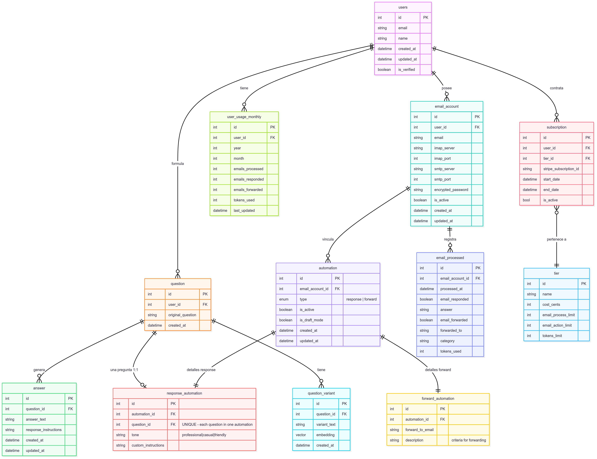

```plaintext
erDiagram
    %% Esquema de Base de Datos - Sistema de Automatización de Email
    %% Actualizado: Tablas en singular, user_id redundante eliminado
    %% ResponseAutomation: 1:1 con pregunta directa
    %% ForwardAutomation: usa description, no preguntas
    users {
        int id PK
        string email
        string name
        datetime created_at
        datetime updated_at
        boolean is_verified
    }
    email_account {
        int id PK
        int user_id FK
        string email
        string imap_server
        int imap_port
        string smtp_server
        int smtp_port
        string encrypted_password
        boolean is_active
        datetime created_at
        datetime updated_at
    }
    question {
        int id PK
        int user_id FK
        string original_question
        datetime created_at
    }
    question_variant {
        int id PK
        int question_id FK
        string variant_text
        vector embedding
        datetime created_at
    }
    answer {
        int id PK
        int question_id FK
        string answer_text
        string response_instructions
        datetime created_at
        datetime updated_at
    }
    automation {
        int id PK
        int email_account_id FK "NO user_id - get via email_account"
        enum type  "response | forward"
        boolean is_active
        boolean is_draft_mode
        datetime created_at
        datetime updated_at
    }
    response_automation {
        int id PK
        int automation_id FK
        int question_id FK "UNIQUE - each question in one automation"
        string tone "professional|casual|friendly"
        string custom_instructions
    }
    forward_automation {
        int id PK
        int automation_id FK
        string forward_to_email
        string description "criteria for forwarding"
    }
    email_processed {
        int id PK
        int email_account_id FK "NO user_id - get via email_account"
        datetime processed_at
        boolean email_responded
        string answer
        boolean email_forwarded
        string forwarded_to
        string category
        int tokens_used
    }
    user_usage_monthly {
        int id PK
        int user_id FK
        int year
        int month
        int emails_processed
        int emails_responded
        int emails_forwarded
        int tokens_used
        datetime last_updated
    }
    tier {
        int id PK
        string name
        int cost_cents
        int email_process_limit
        int email_action_limit
        int tokens_limit
    }
    subscription {
        int id PK
        int user_id FK
        int tier_id FK
        string stripe_subscription_id
        datetime start_date
        datetime end_date
        bool is_active
    }
    users ||--o{ email_account : "posee"
    users ||--o{ user_usage_monthly : "tiene"
    users ||--o{ question : "formula"
    users ||--o{ subscription : "contrata"
    email_account ||--o{ automation : "vincula"
    email_account ||--o{ email_processed : "registra"
    question ||--o{ question_variant : "tiene"
    question ||--o{ answer : "genera"
    question ||--o| response_automation : "una pregunta 1:1"
    automation ||--|| response_automation : "detalles response"
    automation ||--|| forward_automation : "detalles forward"
    subscription }o--|| tier : "pertenece a"

```


